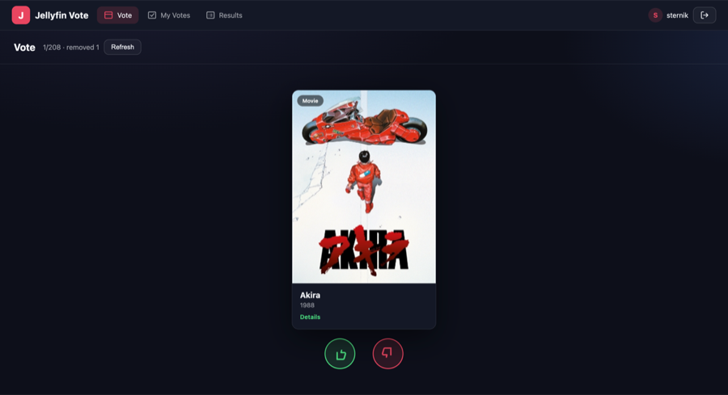
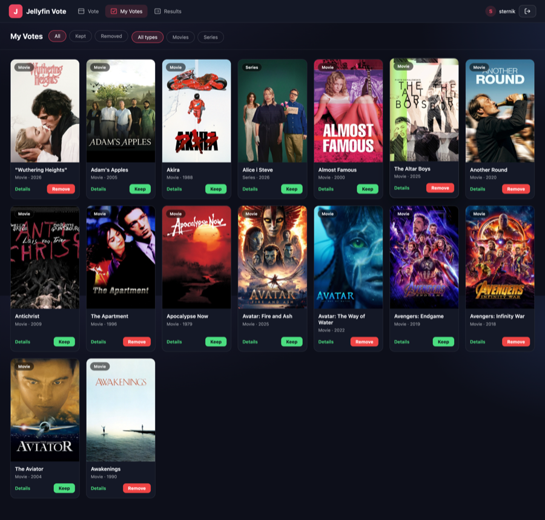
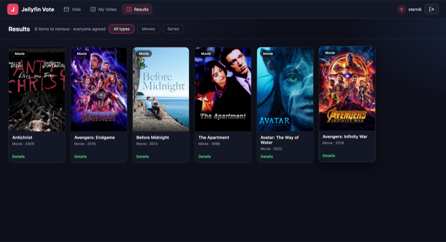

# Jellyfin Vote

A Tinder-style voting app for deciding which movies and series to keep or
remove from your Jellyfin media server. Users swipe through their library,
vote to keep or remove each item, and see aggregated results when everyone
agrees.

> **Not affiliated with Jellyfin.** Jellyfin is a trademark of its respective
> owners. This project is an independent tool that talks to your self-hosted
> Jellyfin server via its public API.

## Screenshots

### Vote



### My Votes



### Results



## Features

- **Swipe to vote** — drag the card left to keep, right to remove, or tap the
  thumbs up / thumbs down buttons.
- **Movie / Series badges** — every card carries its type badge, year, and a
  `Details` deep-link into Jellyfin.
- **My Votes** — review and flip past votes at any time; filter independently
  by **vote status** (`All` / `Kept` / `Removed`) and **media type**
  (`All types` / `Movies` / `Series`).
- **Results** — see exactly which items every user agreed to remove; filter by
  `All types` / `Movies` / `Series`.
- **Multi-user support** — each user keeps their own votes; an item is only
  flagged for deletion when *all* users voted to remove it.
- **Jellyfin integration** — pulls the library (movies + series), posters, and
  metadata directly from Jellyfin; one-click `Details` opens the item in the
  Jellyfin web client.
- **Top-bar UI** — clean, responsive dark theme; the nav collapses to a
  second row on phones, and the vote page scales the card to fit the viewport
  (no scrolling needed to reach the buttons).
- **Per-user storage** — votes live in plain JSON files under `data/`, no
  external database to configure. Per-user endpoints are scoped to the
  session user so nobody can read or overwrite another user's votes.

## Tech Stack

- **Backend:** Flask (Python 3.13)
- **Frontend:** Vanilla HTML/CSS/JS (no build step)
- **Data:** Jellyfin API + local JSON files

## Quick Start

### 1. Clone the repo

```bash
git clone https://github.com/sternik/jellyfin-vote.git
cd jellyfin-vote
```

### 2. Configure environment

Copy the example env file and fill in your Jellyfin details:

```bash
cp .env.example .env
```

Edit `.env`:

```env
SECRET_KEY=replace-with-a-long-random-string
JELLYFIN_URL=https://your-jellyfin-server.example.com/jellyfin
API_KEY=your-jellyfin-api-key
USER_ID=your-jellyfin-user-id
```

> To get your Jellyfin API key: **Dashboard → API Keys → +**
> To get your User ID: open any item in your library via the web UI and inspect
> the URL, or use the Jellyfin API.

`SECRET_KEY` is **required** — the app will refuse to start without it. This
prevents accidentally running with the dev placeholder.

### 3. Create user accounts

Edit `data/users.json` to define who can log in:

```json
{
  "alice": "password123",
  "bob": "secret456"
}
```

### 4. Install & run

#### Option A — `uv` (recommended)

```bash
uv venv
uv sync
uv run python app.py
```

#### Option B — plain `pip`

```bash
python -m venv .venv
source .venv/bin/activate    # Windows: .venv\Scripts\activate
pip install -e .
python app.py
```

Open [http://127.0.0.1:8000](http://127.0.0.1:8000).

### 5. Deployment (Docker)

```bash
cp .env.example .env         # fill in JELLYFIN_URL/API_KEY/USER_ID/SECRET_KEY
# seed data/users.json with accounts
docker compose up --build --detach
# -> http://localhost:8000
```

The compose file mounts `./data` as a volume, so users, votes, media cache,
and posters survive container restarts.

#### Production (gunicorn, no Docker)

```bash
uv sync
uv run gunicorn --bind 0.0.0.0:8000 --workers 2 "jellyfin_vote:create_app()"
```

## How Voting Works

1. Each user swipes through the full Jellyfin library.
2. **thumbs up** (or drag the card left) = keep, **thumbs down** (or drag
   right) = remove.
3. Votes are saved per user on the server (under `data/votes_<user>.json`).
4. An item is marked for deletion only when **every** user voted to remove it.
5. Check the **Results** page to see agreed-upon removals — use the type
   filter to narrow down to movies only or series only.

## Development

Install dev dependencies and run the linters / tests:

```bash
uv sync --extra dev
ruff check .
black --check .
pytest
```

See [CONTRIBUTING.md](CONTRIBUTING.md) for the full workflow and the project
layout.

## Project Structure

```
jellyfin-vote/
├── app.py                     # Dev entry point
├── src/jellyfin_vote/         # Flask app split into modules
│   ├── __init__.py            # create_app() factory
│   ├── config.py              # Environment validation (fail-fast)
│   ├── jellyfin.py            # Jellyfin API client
│   ├── auth.py                # Login / logout / me / require_auth
│   ├── media.py               # Media list / refresh / image proxy
│   ├── votes.py               # Per-user votes (scoped to session)
│   ├── results.py             # Agreed-upon removals
│   └── routes_static.py       # HTML pages + static assets
├── templates/                 # HTML pages
├── static/css|js|img/         # Frontend assets
├── data/                      # Runtime data (gitignored except .gitkeep)
├── screens/                   # Screenshots used in this README
├── tests/                     # pytest suite with fixtures
├── Dockerfile
├── docker-compose.yml
└── .github/workflows/ci.yml   # ruff + black + pytest on push/PR
```

## License

MIT — see [LICENSE](LICENSE).